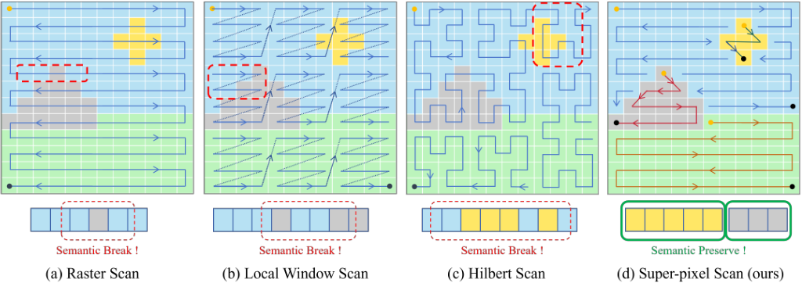
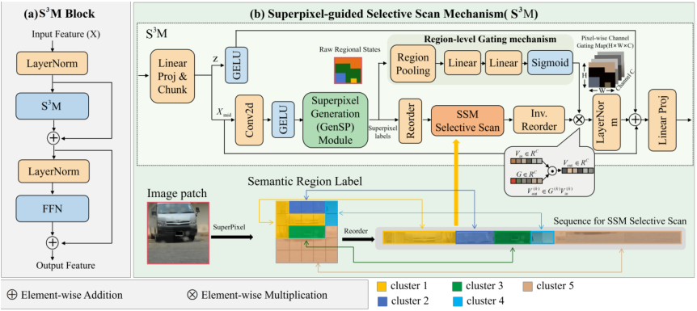

<h1 align="center">[ECCV 2026] Pixel Ignores, Superpixel Sees: Adverse Weather Image Restoration via Semantic-Center SSM</h1>

<p align="center">Official PyTorch implementation</p>

<p align="center">
  <a href="https://github.com/LIDAYU-DayuLi/SSR"></a>
  <a href="https://github.com/LIDAYU-DayuLi/SSR/issues"></a>
</p>

<p align="center">
  <b>Pixel Ignores, Superpixel Sees: Adverse Weather Image Restoration via Semantic-Center SSM</b><br>
  ECCV 2026
</p>

| Motivation | Model Architecture |
| :--: | :--: |
|  |  |

## Visual Results

| Description | Download |
| :-- | :--: |
| Pre-trained model weights | [Google Drive](https://drive.google.com/file/d/1adNJ-UiTcM9DUsqpvQknOpU-putgY_3u/view?usp=drive_link) |
| SSR results on RainDrop | [Google Drive](https://drive.google.com/file/d/1kzLDLXWug_YOv_aiSF5PlOSPIzhIuLlF/view?usp=drive_link) |
| SSR results on Snow100K-S | [Google Drive](https://drive.google.com/file/d/1BawvWUJSc-xb9T8MJjS7dKkiCH6ZCzll/view?usp=drive_link) |
| SSR results on test1 | [Google Drive](https://drive.google.com/file/d/1VcQjfPRP7iT4P7aByC05463SInaGupVn/view?usp=drive_link) |

## Project Structure

- `basicsr/` — Training and testing framework (based on BasicSR)
- `Allweather/` — All-weather restoration configs and utilities
- `basicsr/models/archs/SSR_arch.py` — SSR network architecture

## Requirements

- Python 3.8+
- PyTorch
- einops
- mamba-ssm
- tensorboardX

## Training

```bash
cd basicsr
python train.py -opt ../Allweather/Options/Allweather_SSR.yml
```

Set `dataroot_gt` and `dataroot_lq` in the config file before training.

## Testing

```bash
cd basicsr
python test.py -opt ../Allweather/Options/Allweather_SSR.yml
```
